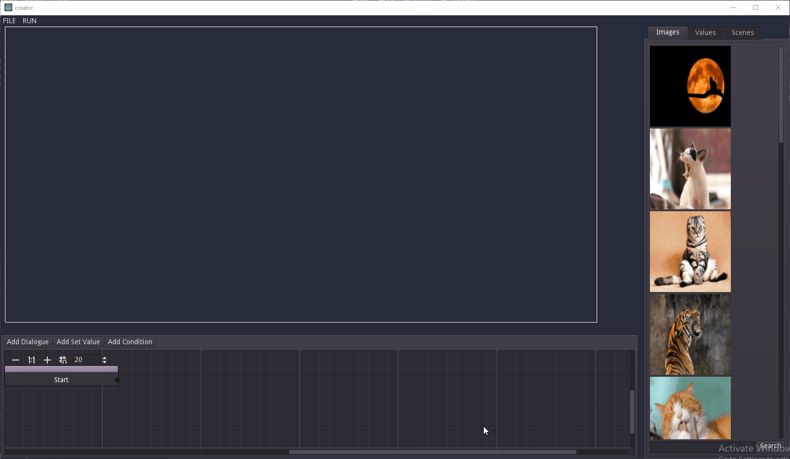

# Creating a game

A game is comprised of one or more scenes. The scenes will be played in the roder that they appear in the `Scenes` tab, from top to bottom.

There is a 2 second wait between the end of one scene and the start of the next scene. At the end of the last scene the game will not exit.

## Images
Add images to a scene using the `Images` tab. See [this](./images.md) for interacting with images.

## Dialogue
Add dialogue and custom logic to the scene using the graph at the bottom of the screen. See [this](./dialogue.md) for more info.

## Testing

To try out your story press the `run` button in the toolbar. This will launch your story from the first scene.

## Releasing

The export your story select `File -> Export` from toolbar. This will create a zip folder that contains everything needed to distribute and run your story.

### Desktop app

A windows version can be distributed using the `.exe` and both `.pck` files contained in the exported zip file.

### HTML

The `html_export` folder in the exported zip file contains everything needed to distrubute a html/wasm version.