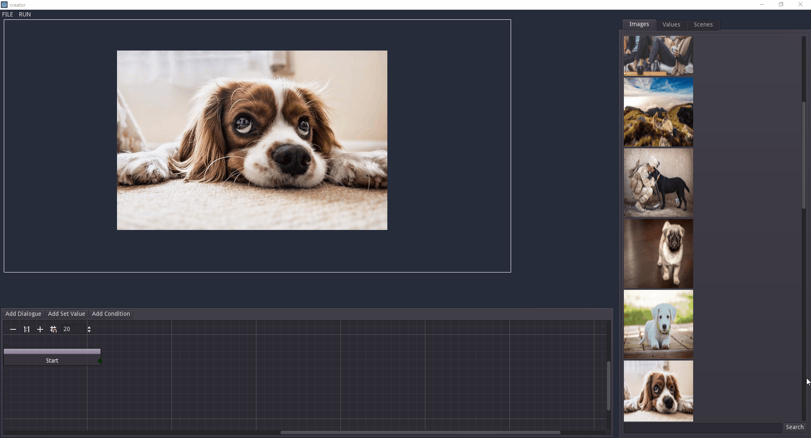
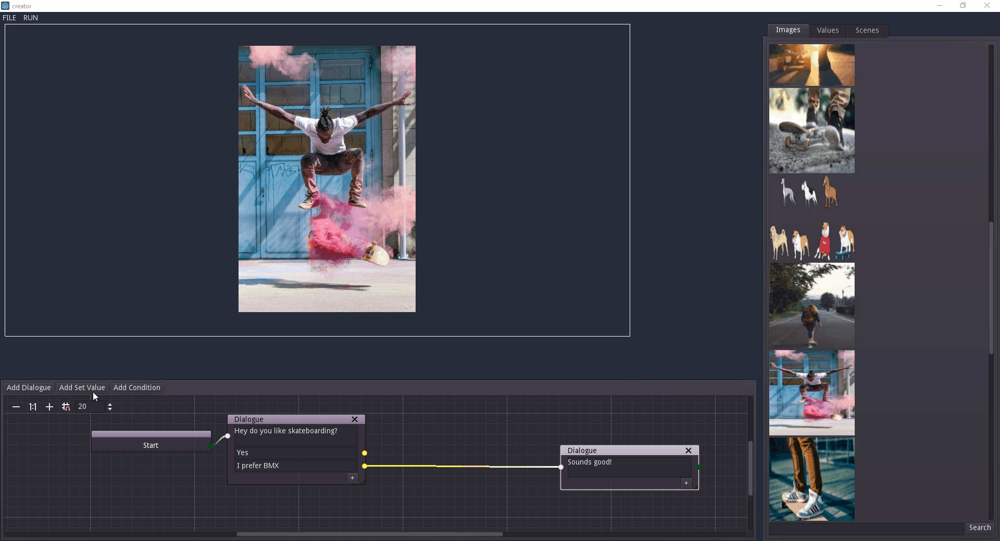
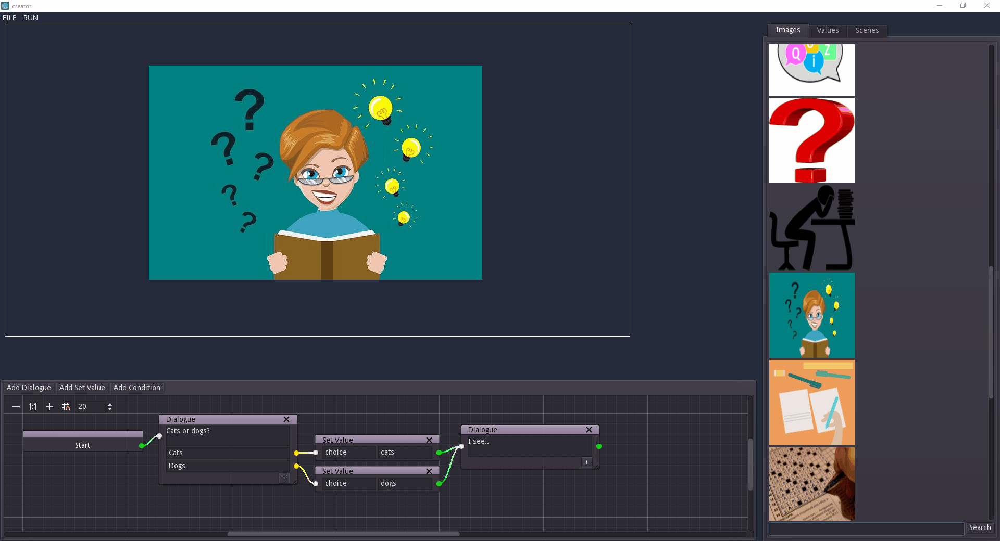

# Dialogue and Logic

Use the graph on the lower half of the screen to add dialogue and conditional checks to each scene.

## Dialogue

Use `Add Dialogue` to add dialogue to the current scene. This will be displayed when the game is run.

You can add response options to each dialogue to create dialogue trees.

## Values

Use `Add Set Value` to modify a value that can be checked elsewhere in the dialogue tree.

Use the `Values` tab to set default values if needed.

All values are available across all scenes.

## Conditions

Use `Add Condition` to branch based on the current state of a value.

