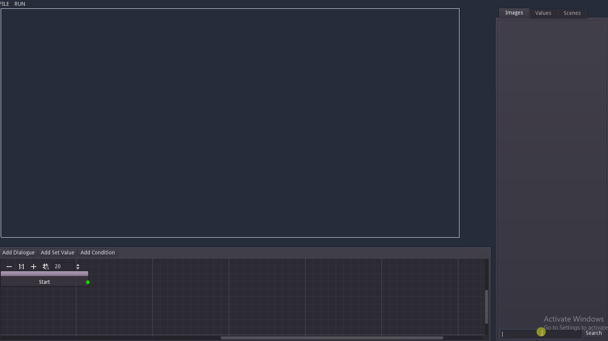
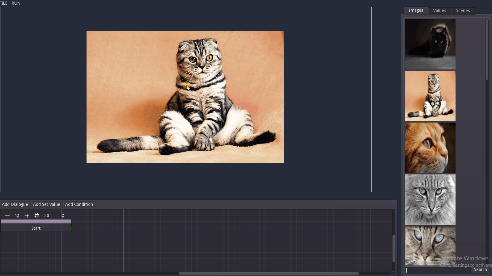
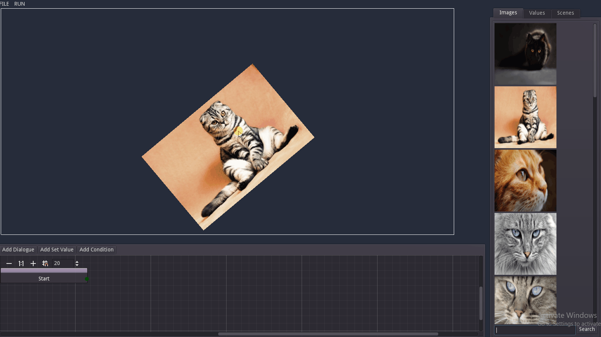
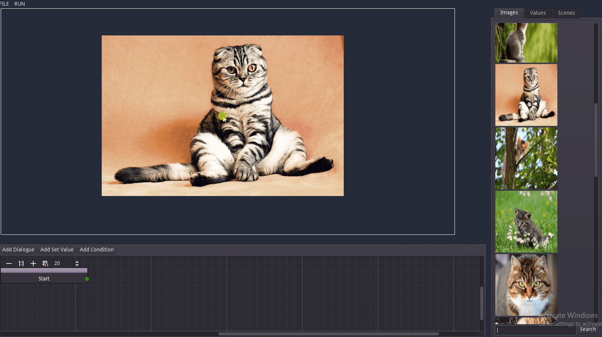
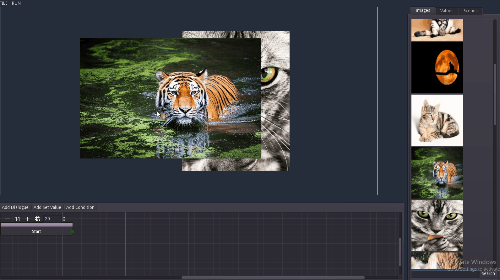
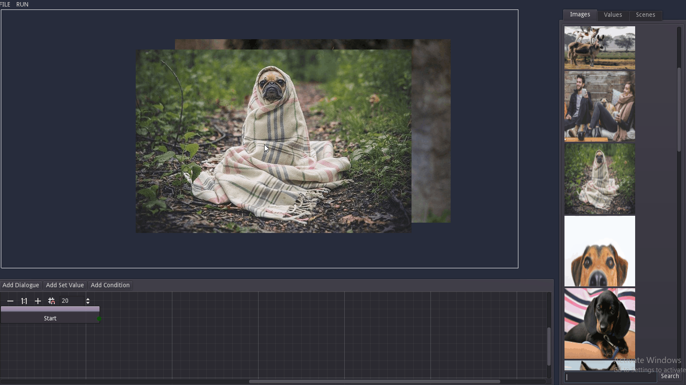

# Images

## Adding an image

To add images to the current scene use the search bar in the 'Art' tab on the right of the screen.

## Using images

### Move

`hold mouse left` + `drag`

### Rotate

`hold mouse left` + `hold shift` + `scroll mouse wheel`

### Resize

`hold mouse left` + `scroll mouse wheel`

### Move to front/back

`hold mouse left` + `hold left ctrl` + `scroll mouse wheel`

### Delete

`holse mouse left` + `press del`

